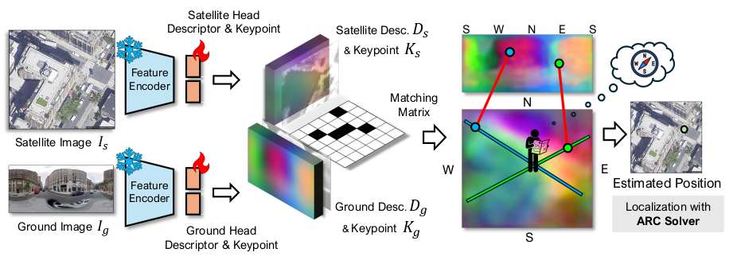
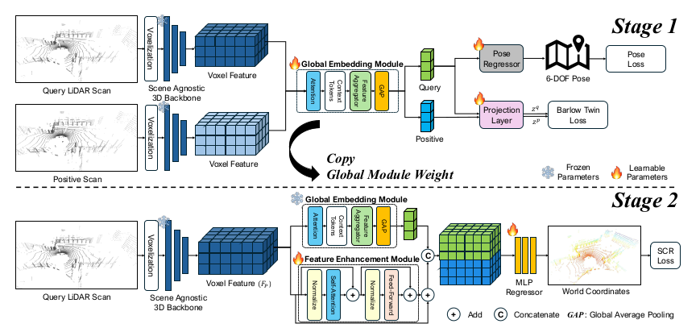
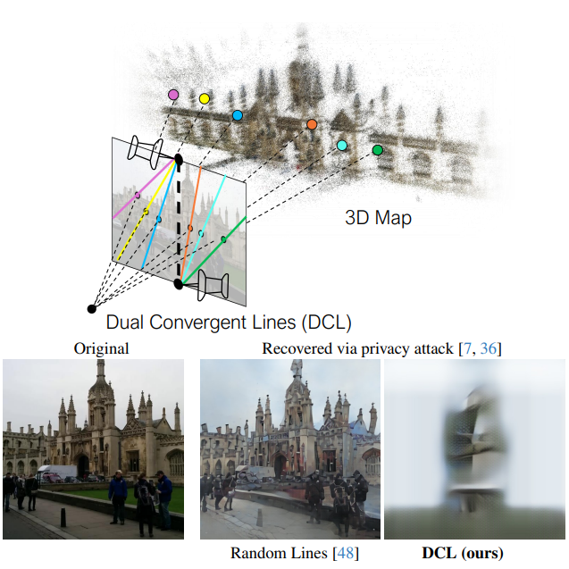
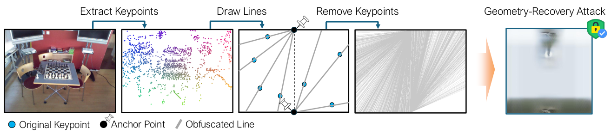
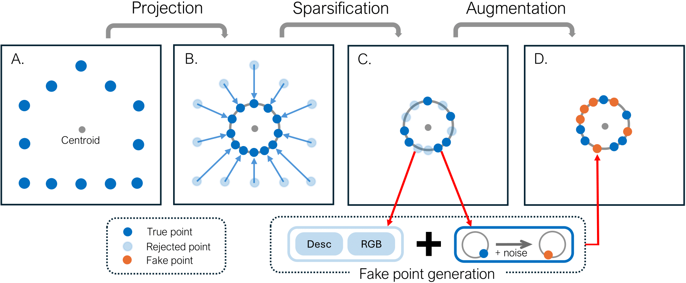
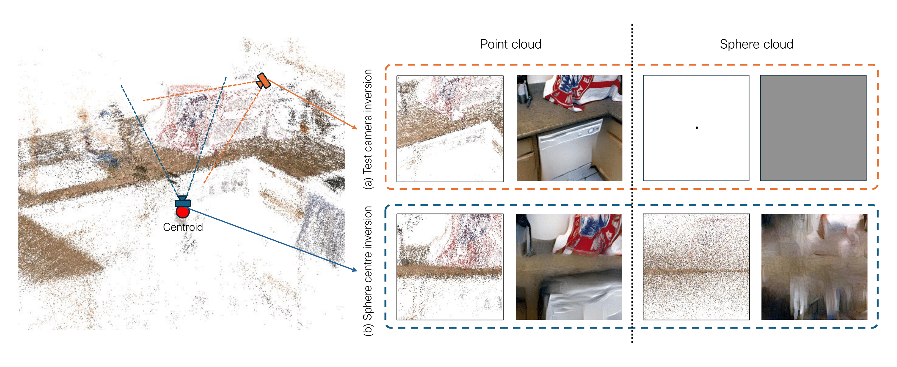
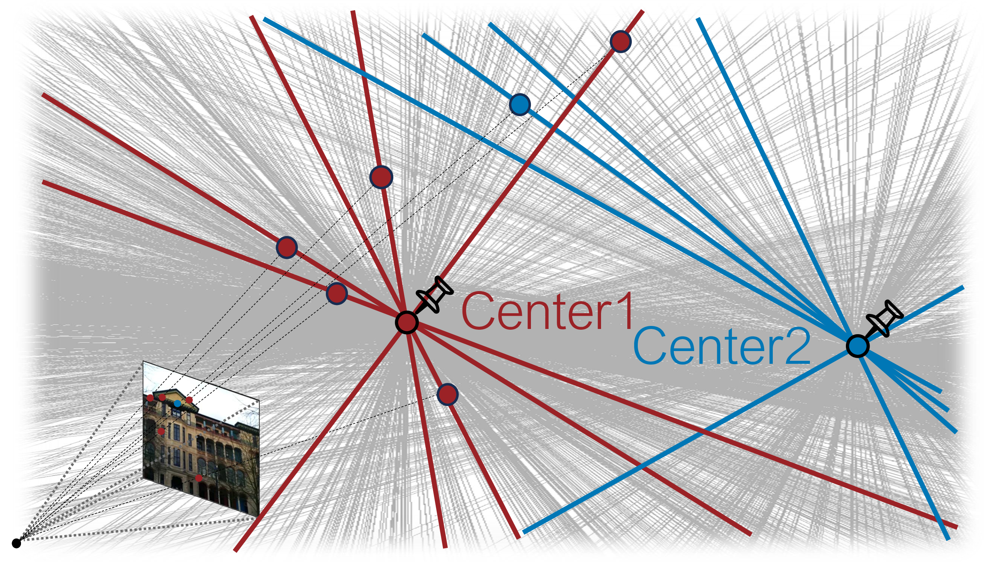
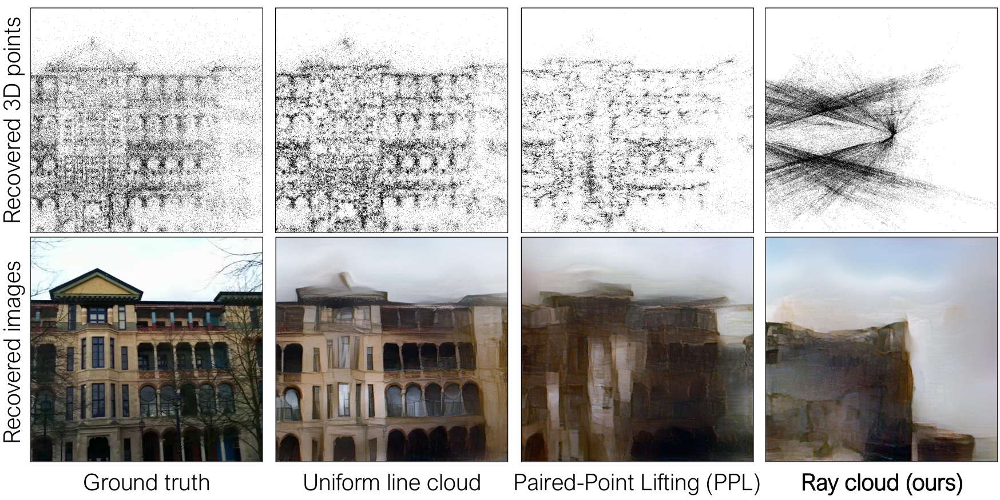
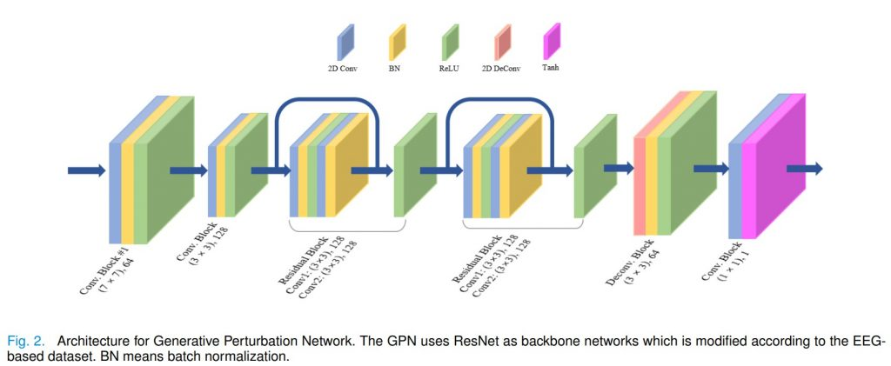

## About Me 👨‍💻
👋 Hi there, I'm Heejoon. Thanks for visiting my website! ✨ 
 
I'm a 1st year Ph.D. student at Hanyang university, [Spatial AI Lab](https://www.sailab.kr/
) (Advisor: Prof. [Je Hyeong Hong](https://zrr.kr/YkZK)). Previously, I was an undergraduate researcher at [AIR (AI & Robotics) Lab](http://airlab.khu.ac.kr/), advised by Prof. [Hyosoek Hwang](https://zrr.kr/OzVb) at KyungHee University.

## Research Interests 📚

- **Geometric Computer Vision:** Visual Localization, 3D Line Geometry, Structure-from-Motion
- **Embodied AI:** Sensor Fusion Based Perception in Robotics & Autonomous Vehicles   
- **Spatial AI:** Camera & LiDAR Localization, Scene Coordinate Regression

## News 📰
 - **[Jun. 2026]** One paper is accpeted to **ECCV 2026**! 🇸🇪
 - **[Jun. 2026]** One paper is accpeted to **IROS 2026**! 🇺🇸
 - **[Apr. 2026]** Our paper has been selected for an **Oral Presentation and Award Candidate** (Top 0.89\% of accepted papers) at CVPR 2026!
 - **[Feb. 2026]** I'll serve as a conference reviewer of **ECCV 2026**
 - **[Feb. 2026]** One paper is accpeted to **CVPR 2026**! 🇺🇸
 - **[Nov. 2025]** I'll serve as a conference reviewer of **CVPR 2026**!

  
<strong>More news</strong>

  <ul>
    <li><strong>[Sep. 2025]</strong> I'll serve as a conference reviewer of <strong>3DV 2026</strong>!</li>
    <li><strong>[Jul. 2025]</strong> I've accepted an internship at Hyundai Rotem as a research intern (3D Computer Vision)</li>
    <li><strong>[Aug. 2024]</strong> I have been invited to present at the poster session in Korean Conference on Computer Vision (KCCV) 2024 🇰🇷</li>
    <li><strong>[Aug. 2024]</strong> One paper is accepted to <strong>BMVC 2024</strong> 🇬🇧</li>
    <li><strong>[Feb. 2024]</strong> One paper is accepted to <strong>CVPR 2024</strong> 🇺🇸</li>
    <li><strong>[Aug. 2024]</strong> Started Integrated MS-PhD journey at the Hanyang University <a href="https://www.sailab.kr/">Spatial AI Lab</a> 🎓</li>
    <li><strong>[Aug. 2023]</strong> I graduated <strong>Summa Cum Laude</strong>, ranked top 1 out of college. What an honor! 🏆🎓</li>
    <li><strong>[Aug. 2023]</strong> One paper got accepted to <strong>IEEE Journal of Biomedical and Health Informatics (IF: 7.7)</strong> 📄</li>
    <li><strong>[Jun. 2023]</strong> I was awarded the <strong>LG Electronics Group Best Paper Award</strong> at the 2023 IEIE Summer Annual Conference 🏆</li>
  </ul>

  
## Education 🎓

- [**Integrated MS-PhD**] Hanyang university, Dept. of Artificial Intelligence (2023.09 ~ Present)
- [**BS**] KyungHee university, Dept. of Software Convergence, Robot & Vision Track (2018.03. ~ 2023.08)

<!-- ## I'm currently working & studying 
- Privacy-Preserving Localization
- 3D Vision & SLAM -->

## Working Experiences 🧑‍💼
<table>
  <tr>
    <td style="border: none; padding-right: 20px;">
      
    </td>
    <td style="border: none; vertical-align: middle;">
      <strong>[Hyundai Rotem]</strong> 3D Computer Vision Research Intern (2025.07 ~ 2025.08)
       
      Sensor Fusion based 3D Anomaly Detection.
    </td>
  </tr>
</table>

## Selected Papers 📄

### ARC-Loc: Leveraging Azimuthal Ray Convergence as a Geometric Cue for Direct Cross-View Localization

  

Hyeongsik Kim*, Mincheol Kim*, **Heejoon Moon** and Je Hyeong Hong 
_European Conference on Computer Vision (ECCV), 2026_

### ReLoc: Rethinking Scene Coordinate Regression Architecture for Robust Outdoor LiDAR-based Localization

  
  <video controls style="height: 200px; width: auto; display: block; margin: 0; padding: 0;">
    <source src="../images/ReLoc_IROS.mp4" type="video/mp4">
  </video>

**Heejoon Moon**, Yurim Cho, and Je Hyeong Hong  
_IEEE/RSJ International Conference on Intelligent Robots and Systems (IROS), 2026._

### Revisiting Geometric Obfuscation with Dual Convergent Lines for Privacy-Preserving Image Queries in Visual Localization

  
  

Jeonggon Kim, **Heejoon Moon**, Je Hyeong Hong  
_IEEE/CVF Conference on Computer Vision and Pattern Recognition (CVPR), <strong>ORAL presentation</strong>, 2026._ 
[PDF](https://openaccess.thecvf.com/content/CVPR2026/papers/Kim_Revisiting_Geometric_Obfuscation_with_Dual_Convergent_Lines_for_Privacy-Preserving_Image_CVPR_2026_paper.pdf) | [Code](https://github.com/SpatialAILab/DCL-privacy-preserving-visual-localization)

---

### Depth-Guided Privacy-Preserving Visual Localization Using 3D Sphere Clouds

  
  

**Heejoon Moon**, Jongwoo Lee, Jeonggon Kim, Je Hyeong Hong  
_British Machine Vision Conference (BMVC), 2024._  
[PDF](https://bmva-archive.org.uk/bmvc/2024/papers/Paper_267/paper.pdf) | [Code](https://github.com/PHANTOM0122/Sphere-cloud)

---

### Efficient Privacy-Preserving Visual Localization Using 3D Ray Clouds 

**Heejoon Moon**, Chungwhan Lee, Je Hyeong Hong  
_IEEE/CVF Conference on Computer Vision and Pattern Recognition (CVPR), 2024._  
[PDF](https://openaccess.thecvf.com/content/CVPR2024/papers/Moon_Efficient_Privacy-Preserving_Visual_Localization_Using_3D_Ray_Clouds_CVPR_2024_paper.pdf) | [Code](https://github.com/PHANTOM0122/Ray-cloud)

---

### Generative Perturbation Network for Universal Adversarial Attacks on Brain-Computer Interfaces 

Jiyoung Jung, **Heejoon Moon**, Geunhyeok Yu, Hyoseok Hwang  
_IEEE JOURNAL OF BIOMEDICAL AND HEALTH INFORMATICS_  
[PDF](https://ieeexplore.ieee.org/stamp/stamp.jsp?tp=&arnumber=10213992) | [Code](https://github.com/AIRLABkhu/Generative-Perturbation-Networks)

## Selected Projects 🚀
- [**3D Reconstruction with Multi-View RGB-D Images**](https://github.com/PHANTOM0122/3D_Object_Reconstruction) (Github stars: 85)
- [ **KITTI360 Tutorial** ](https://github.com/PHANTOM0122/KITTI360_Tutorial)
- [ **Turtlebot Manipulation with Optical Flow in Gazebo Simulation** ](https://github.com/PHANTOM0122/ROS_Gazebo_Simulator_with_Opticalflow)
- [ **3D Reconstruction using Stereo Vision** ](https://github.com/PHANTOM0122/3D_Reconstruction)
- [ **Image Style Transfer** ](https://github.com/Hyper-Vision-DeepLearning/Style-Transfer)

## Hobby
- Golf
- Big fan of Doosan Bears baseball team, KBO!
