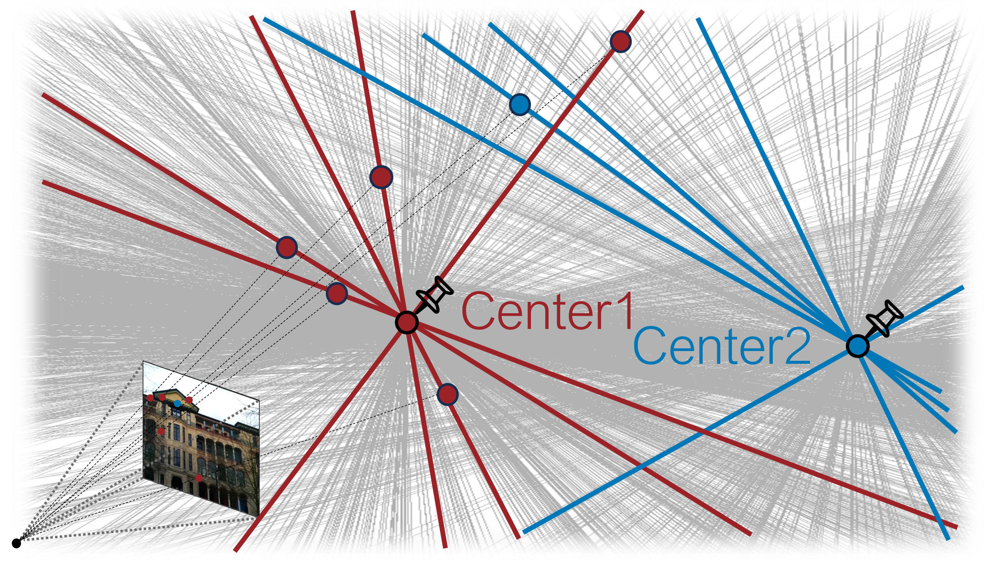

## About Me 👨‍💻
👋 Hi there, I'm Heejoon. Thanks for visiting my website! ✨ 
 
I'm a 2nd-year Integrated MS-Ph.D. student at Hanyang university, [Spatial AI Lab](https://www.sailab.kr/
) (Advisor: Prof. [Je Hyeong Hong](https://zrr.kr/YkZK)).     
Previously, I was an undergraduate researcher at [AIR (AI & Robotics) Lab](http://airlab.khu.ac.kr/
), advised by Prof. [Hyosoek Hwang](https://zrr.kr/OzVb) at KyungHee University.     

## Research Interests 📚

- **Geometric Computer Vision:** Visual Localization, 3D Line Geometry, Structure-from-Motion
- **Embodied AI:** Sensor Fusion Based Perception in Robotics & Autonomous Vehicles   
- **Spatial AI:** 3D Foundation Models, Implicit Scene Representations

## News 📰

- **[AUg. 2024]** I have been invited to present at the poster session in Korean Conference on Computer Vision (KCCV) 2024 🇰🇷 
- **[Aug. 2024]** One paper got accepted to **BMVC 2024** 🇬🇧
- **[Feb. 2024]** One paper got accepted to **CVPR 2024** 🇺🇸
- **[Aug. 2024]** Started Integrated MS-PhD journey at the Hanyang University [Spatial AI Lab](https://www.sailab.kr/) 🎓
- **[Aug. 2023]** I graduated **Summa Cum Laude**, ranked top 1 out of college. What an honor! 🏆🎓
- **[Aug. 2023]** One paper got accepted to **IEEE Journal of Biomedical and Health Informatics (IF: 7.7)** 📄 
- **[Jun. 2023]** I was awarded the **LG Electronics Group Best Paper Award** at the 2023 IEIE Summer Annual Conference 🏆

  
## Education 🎓

- [**Integrated MS-PhD**] Hanyang university, Dept. of Artificial Intelligence (2023.09 ~ Present)
- [**BS**] KyungHee university, Dept. of Software Convergence, Robot & Vision Track (2018.03. ~ 2023.08)

<!-- ## I'm currently working & studying 
- Privacy-Preserving Localization
- 3D Vision & SLAM -->

## Selected Papers 📄

### Depth-Guided Privacy-Preserving Visual Localization Using 3D Sphere Clouds

**Heejoon Moon**, Jongwoo Lee, Jeonggon Kim, Je Hyeong Hong  
_British Machine Vision Conference (BMVC), 2024._  
[PDF](https://bmva-archive.org.uk/bmvc/2024/papers/Paper_267/paper.pdf) | [Code](https://github.com/PHANTOM0122/Sphere-cloud)

### Efficient Privacy-Preserving Visual Localization Using 3D Ray Clouds 

**Heejoon Moon**, Chungwhan Lee, Je Hyeong Hong  
_IEEE/CVF Conference on Computer Vision and Pattern Recognition (CVPR), 2024._  
[PDF](https://openaccess.thecvf.com/content/CVPR2024/papers/Moon_Efficient_Privacy-Preserving_Visual_Localization_Using_3D_Ray_Clouds_CVPR_2024_paper.pdf) | [Code](https://github.com/PHANTOM0122/Ray-cloud)

### Generative Perturbation Network for Universal Adversarial Attacks on Brain-Computer Interfaces 

Jiyoung Jung, **Heejoon Moon**, Geunhyeok Yu, Hyoseok Hwang  
_IEEE JOURNAL OF BIOMEDICAL AND HEALTH INFORMATICS_  
[PDF](https://ieeexplore.ieee.org/stamp/stamp.jsp?tp=&arnumber=10213992) | [Code](https://github.com/AIRLABkhu/Generative-Perturbation-Networks)

## Selected Projects 🚀
- [ **3D Reconstruction with Multi-View RGB-D Images** (Github stars: 85) ](https://github.com/PHANTOM0122/KITTI360_Tutorial)
- [ **KITTI360 Tutorial** ](https://github.com/PHANTOM0122/KITTI360_Tutorial)
- [ **Turtlebot Manipulation with Optical Flow in Gazebo Simulation** ](https://github.com/PHANTOM0122/ROS_Gazebo_Simulator_with_Opticalflow)
- [ **3D Reconstruction using Stereo Vision** ](https://github.com/PHANTOM0122/3D_Reconstruction)
- [ **Image Style Transfer** ](https://github.com/Hyper-Vision-DeepLearning/Style-Transfer)

## Hobby
- Golf
- Big fan of Doosan Bears baseball team, KBO!
