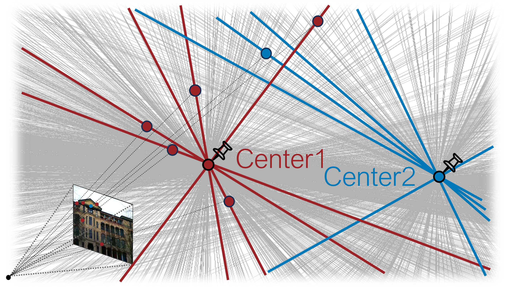
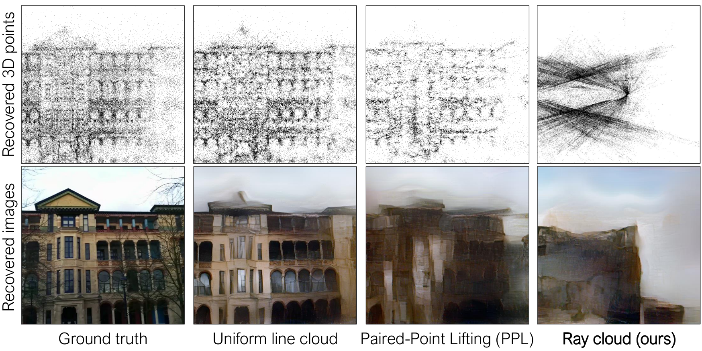

# [CVPR 2024] Efficient Privacy-Preserving Visual Localization Using 3D Ray Clouds
\[[Paper](https://openaccess.thecvf.com/content/CVPR2024/papers/Moon_Efficient_Privacy-Preserving_Visual_Localization_Using_3D_Ray_Clouds_CVPR_2024_paper.pdf)] \[[Supplementary document](https://openaccess.thecvf.com/content/CVPR2024/supplemental/Moon_Efficient_Privacy-Preserving_Visual_CVPR_2024_supplemental.pdf)] 
 
**Presentation video:** 
 
**Authors:** [Heejoon Moon](https://github.com/PHANTOM0122), [Chunghwan Lee](https://github.com/Fusroda-h), [Je Hyeong Hong](https://sites.google.com/view/hyvision)

 

The recent success in revealing scene details from sparse 3D point clouds obtained via structure-from-motion has raised significant privacy concerns in visual localization. One prominent approach for mitigating this issue is to lift 3D points to 3D lines thereby reducing the effectiveness of the scene inversion attacks but this comes at the cost of increased algorithmic complexity for camera localization due to weaker geometric constraints induced by line clouds. To overcome this limitation we propose a new lifting approach called "ray cloud" whereby each lifted 3D line intersects at one of two predefined locations depicting omnidirectional rays from two cameras. This yields two benefits i) camera localization can now be cast as relative pose estimation between the query image and the calibrated rig of two perspective cameras which can be efficiently solved using a variant of the 5-point algorithm and ii) the ray cloud introduces erroneous estimations for the density-based inversion attack degrading the quality of scene recovery. Moreover we explore possible modifications of the inversion attack to better recover scenes from the ray clouds and propose a ray sampling technique to reduce the effectiveness of the modified attack. Experimental results on two public datasets show real-time localization speed as well as enhanced privacy-preserving capability over the state-of-the-art without overly sacrificing the localization accuracy.